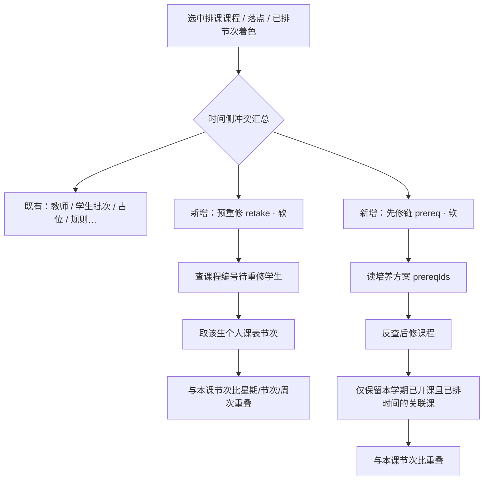

# 排时间侧 · 预重修冲突与先修冲突改动方案

> 文档性质：代码改动方案（需求整理 · 实现指引）  
> 适用范围：排课管理 · 排课表时间（排课详情课表格冲突检测 / 着色 / 弹窗）  
> 状态：**关键规则已确认** / 可按本文直接改代码  
> 关联现状：`prototype/app.js`（`detectSchedulePlaceConflicts`、`recomputeSchedulePlaceConflictFlags`、`getScheduleConflictCellKeys`）、`prototype/index.html`（冲突图例）、培养方案 `programCourses.prereqIds`

---

## 0. 已确认结论（2026-07-23）

| # | 结论 |
|---|------|
| C1 | **预重修、先修均为软冲突**，允许「继续排课」 |
| C2 | 预重修对照精确到**学生个人课表**（非整批课表） |
| C3 | 先修冲突仅判断**本学期已开课**（有排课任务且已排时间）的先修/后修 |
| C4 | 合班/多批次按**学生个人所属批次**比对个人课表 |
| C5 | 冲突着色使用**独立色**（`is-conflict-retake` / `is-conflict-prereq`） |
| C6 | **不展示**「有待重修/先修关系但无时间冲突」的弱提示；无冲突则无任何该类提示 |

---

## 1. 背景与目标

排时间侧现有冲突以**教师冲突、学生批次冲突、不排课/选修占位、教师排课时段、排课规则**为主。选中课程排时间时，缺少两类教务常见约束：

1. **预重修冲突**：本课程存在待重修（成绩不及格）学生时，其**个人课表**若与本课拟排/已排时间重叠，应提示。  
2. **先修冲突**：本课程与本学期已开课的先修课程、后修课程在时间上重叠时，应提示。

### 1.1 本期目标

| # | 目标 |
|---|------|
| G1 | 选中课程后，检测该**课程编号**是否存在待重修（不及格）学生 |
| G2 | 若有待重修学生，检测其**个人课表**与本课（拟排/已排）时间是否冲突，并提醒 |
| G3 | 检测本课与**本学期已开课**的先修 / 后修课程已排时间是否冲突，并提醒 |
| G4 | 两类冲突纳入时间侧统一冲突模型：课表格**独立色**着色、落点弹窗、图例 |
| G5 | 原型补齐最小 mock（待重修学生 + 个人已选教学班；先修复用 `prereqIds`，后修反查） |

### 1.2 非目标

- 不实现真实成绩系统对接；本期仅原型 mock。  
- 不改排教室侧冲突模型（仍只做教室三类冲突）。  
- 不将预重修/先修设为硬冲突（已确认可继续排课）。  
- 不在本期做「先修未修完禁止开课」的开课计划校验（仅排时间冲突）。  
- 无时间冲突时不展示任何预重修/先修弱提示。

---

## 2. 业务定位



| 维度 | 现有学生冲突 | 预重修冲突 | 先修冲突 |
|------|--------------|------------|----------|
| 触发对象 | 同专业批次其它课 | 待重修生**个人课表** | 本学期已开课的先修/后修教学班 |
| 数据依据 | `programmeKey` + `intake` | 不及格名单 + 个人已选教学班 | `prereqIds` + 反查后修 |
| 对照范围 | 批次级任务重叠 | 按学生个人批次取个人课表 | 本学期已排关联课 |
| 强度 | 硬 | **软**（可继续） | **软**（可继续） |
| 无冲突时 | — | **不提示** | **不提示** |

---

## 3. 冲突模型

### 3.1 类型一览

| 类型 key | 中文名 | 强度 | 判定规则 | 触发时机 |
|----------|--------|------|----------|----------|
| `retake` | 预重修冲突 | **软冲突** | 见 §3.2 | 选中课程后着色；落点/点已排节次弹窗；初始化已排着色 |
| `prereq` | 先修冲突 | **软冲突** | 见 §3.3 | 同上 |

图例（**独立色**，已确认）：

| key | 图例文案 | `data-sch-leg` | 着色 class |
|-----|----------|----------------|------------|
| `retake` | 预重修冲突 | `time` | `is-conflict-retake` |
| `prereq` | 先修冲突 | `time` | `is-conflict-prereq` |

多种冲突并存时：`primary = 'mixed'`，格子用综合冲突色；弹窗分行展示各类型明细。

### 3.2 预重修冲突（`retake`）判定

#### 3.2.1 待重修学生定义（原型）

新增 mock 表 `SCHEDULE_RETAKE_STUDENTS`：

| 字段 | 说明 |
|------|------|
| `studentNo` | 学号 |
| `studentName` | 姓名 |
| `courseCode` | 待重修课程编号（与排课 `task.code` 对齐） |
| `catalogId` | 可选 |
| `programmeKey` | 学生所属专业 |
| `intake` | 学生入学批次（多批次时按此个人批次取课表） |
| `grade` | 不及格成绩（如 `F` / `45`） |
| `termCode` | 成绩所属学期（可选） |
| `status` | 固定 `pending_retake` |
| `enrolledSectionIds` | **个人本学期已选教学班 id 列表**（个人课表精确口径） |

筛选：

```
courseCode === 当前课程.code
&& status === 'pending_retake'
```

演示数据：至少 1～2 门已排课程各挂 1 名重修生；`enrolledSectionIds` 指向与本课时间重叠的其它已排教学班，便于验收。

#### 3.2.2 个人课表口径（已确认：精确到学生个人）

对每一名待重修学生：

1. 取其个人 `programmeKey`、`intake`（合班课也**只按该生自己的批次**，不扫合班全部批次）。  
2. 构建**个人课表节次集**：  
   - 优先：`enrolledSectionIds` → 在 `SCHEDULE_TASK_STORE` / 开课 section 中取对应任务的已排 `timeSlots`；  
   - 若某 id 无任务，跳过；  
   - 原型若暂无名单引擎，mock 必须带齐 `enrolledSectionIds`，**禁止**回退为「整批 `getScheduleTasksForBatch` 全部课程」（避免假冲突）。  
3. 排除当前正在排的同一教学班（`task.id === activeTask.id`）。  
4. 本课目标节次（拟排或已排）与个人课表节次比：星期相同、节次重叠、周次重叠。  
5. 命中文案示例：  
   `周三第3节 与重修生周可（学号 S20240012 · 202409）个人课表中 ACC101 财务管理 冲突`

聚合：

- 同格多名重修生：弹窗按学生分行；着色只记一次。  
- 无待重修生，或有重修生但个人课表无重叠：**不产生 `retake`，不展示任何提示**。

#### 3.2.3 周次口径

| 场景 | 本课侧周次 |
|------|------------|
| 新排落点 | `scheduleDraftWeeks` |
| 已选节次重排/着色 | `slot.weeks`（空则 `task.weeks`） |
| 个人课表对照 | 对照节次 `slot.weeks || task.weeks` |

### 3.3 先修冲突（`prereq`）判定

#### 3.3.1 先修 / 后修课程集合

1. **先修**：`programCourses.prereqIds`（catalogId 列表）。  
2. **后修**：同专业课程中 `prereqIds` 含当前课 catalogId 的课程（反查，不落库）。  
3. 去重得 `relatedCourseKeys`。

解析顺序：当前学期执行计划 / 开课关联方案课程 → 回退 `PROGRAM_COURSES` → 仍无则不产生先修冲突。

#### 3.3.2 仅本学期已开课（已确认）

关联课程必须同时满足：

1. 当前开课学期任务库中存在对应教学班（`getScheduleTaskRows()` / 开课计划已生成任务）；  
2. 该教学班**已排时间**（`taskHasBatchTime` / 存在有效 `timeSlots`）。

未开课、已开课但未排时间的先修/后修：**不参与**冲突判断，也不提示。

#### 3.3.3 时间冲突口径

1. 过滤出本学期已开课且已排的关联课任务。  
2. 排除当前教学班自身。  
3. 本课目标节次与关联课已排节次比：星期 / 节次 / 周次重叠。  
4. 文案区分先修/后修：  
   - `周三第3节 与先修课程 FIN101 微积分 已排时间冲突`  
   - `周三第3节 与后修课程 FIN301 中级财务 已排时间冲突`

合班关联课：命中任一已排教学班即可；文案带课程号与批次/班标签。无重叠则**不提示**。

### 3.4 强度与「继续排课」（已确认）

| 冲突 | 强度 | 落点弹窗 | 课表格着色 |
|------|------|----------|------------|
| `retake` | **软** | 显示「继续排课」 | 独立色 `retake` |
| `prereq` | **软** | 显示「继续排课」 | 独立色 `prereq` |
| 与硬冲突（教师/学生等）并存 | 整体按硬冲突 | **禁止**继续 | `mixed` / 硬冲突优先 |

`recomputeSchedulePlaceConflictFlags`：

- `retake` / `prereq` 计入 `hasSoftConflict`、`hasForceableSoft`（可继续）；  
- **不计入** `hasHardConflict`；  
- `primary`：单类型为 `retake` / `prereq`；与其它 grid 类型并存为 `mixed`。

---

## 4. 界面与交互

### 4.1 冲突图例

排时间详情增加（仅 `data-sch-leg="time"`）：

- 预重修冲突（独立色）  
- 先修冲突（独立色）  

排教室侧隐藏。

### 4.2 触发时机

| 时机 | 行为 |
|------|------|
| 初始化进入详情（未选课程） | 已排节次占用态着色含 `retake` / `prereq`（仅命中时） |
| 左侧选中课程 | 按该课草稿周次刷新冲突色 |
| 点选已排节次 | 有冲突才弹窗分行；无冲突不弹这两类 |
| 空格新排 / 移动落点 | 软冲突可继续排课 |

### 4.3 弹窗文案

```
预重修冲突：
  …
先修冲突：
  …
```

仅当对应数组非空时渲染该块。标题：单类型用「预重修冲突提醒 / 先修冲突提醒」；综合用「综合冲突提醒」。

### 4.4 明确不做

- ~~选中课程后展示「存在 N 名待重修学生」~~  
- ~~展示先修/后修清单但无时间冲突的提示~~  
- ~~无冲突时的任何预重修/先修弱提示~~  

---

## 5. 数据与状态

### 5.1 新增 mock

```js
const SCHEDULE_RETAKE_STUDENTS = [
  {
    studentNo: 'S20240012',
    studentName: '周可',
    courseCode: '…',           // 当前待重修课程号
    catalogId: '…',
    programmeKey: 'fin',
    intake: '202409',          // 个人批次
    grade: 'F',
    termCode: '202504',
    status: 'pending_retake',
    enrolledSectionIds: ['sec-…'] // 个人本学期已选教学班（个人课表）
  }
];
```

### 5.2 复用数据

| 数据 | 来源 | 用途 |
|------|------|------|
| 先修 | `programCourses.prereqIds` | 先修集合 |
| 后修 | 反查 `prereqIds` | 后修集合 |
| 本学期已开课 | `getScheduleTaskRows()` + 已排时间 | 先修冲突过滤 |
| 个人课表 | `enrolledSectionIds` → 任务节次 | 预重修对照 |
| 周次重叠 | `scheduleWeeksOverlap` | 统一口径 |

### 5.3 不落库

冲突仅运行时计算，不写入 `SCHEDULE_TASK_STORE.conflicts`。

---

## 6. 代码改动范围

### 6.1 `prototype/app.js`

| 改动点 | 说明 |
|--------|------|
| `SCHEDULE_RETAKE_STUDENTS` | 含 `enrolledSectionIds` |
| `getScheduleRetakeStudentsForCourse(courseCode)` | 待重修生 |
| `getScheduleStudentPersonalSlots(student)` | 由 `enrolledSectionIds` 展开个人已排节次 |
| `getSchedulePrereqAndPostreqKeys(task)` | 先修 + 后修 |
| `getScheduleOpenedRelatedTasks(task, keys)` | **仅本学期已开课且已排**的关联任务 |
| `detectScheduleRetakeConflicts(...)` | 按个人课表检测 |
| `detectSchedulePrereqConflicts(...)` | 按本学期已开课关联课检测 |
| 扩展 `detectSchedulePlaceConflicts` | 写入 `retake` / `prereq` |
| 扩展 `recomputeSchedulePlaceConflictFlags` | soft + primary 独立类型 |
| 扩展 `scheduleConflictAffectsGrid` | 两类参与着色 |
| 扩展 `getScheduleOccupiedTimeConflictCellKeys` | 未选课程路径 |
| 扩展 `openSchedulePlaceConflictModal` / `getScheduleConflictPrimaryLabel` | 分行与标题 |
| `canForceSchedulePlaceDespiteConflicts` | 含 retake/prereq 时可继续 |

### 6.2 `prototype/index.html`

- 图例增加「预重修冲突」「先修冲突」。

### 6.3 `prototype/styles.css`

- `.schedule-grid-cell.is-conflict-retake`  
- `.schedule-grid-cell.is-conflict-prereq`  
- 图例色点独立，不与 soft 混用。

### 6.4 不改

- 排教室侧教室三类冲突  
- 培养方案表结构（后修不落库）  
- 成绩正式模块

---

## 7. 实现步骤

1. 补 `SCHEDULE_RETAKE_STUDENTS`（含个人 `enrolledSectionIds`）并确认先修链在本学期有已排任务。  
2. 实现个人课表展开、先修/后修（本学期已开课）过滤。  
3. 实现 `detectScheduleRetakeConflicts` / `detectSchedulePrereqConflicts`。  
4. 接入冲突汇总、独立色着色、弹窗、可继续排课。  
5. 联调验收 §9。

---

## 8. 关键函数与切入点

```
detectSchedulePlaceConflicts
        │
        ├─ detectScheduleRetakeConflicts
        │     ├─ getScheduleRetakeStudentsForCourse(code)
        │     └─ getScheduleStudentPersonalSlots(student)  // 个人课表
        │           └─ 按学生 intake，不扫合班其它批次
        │
        └─ detectSchedulePrereqConflicts
              ├─ getSchedulePrereqAndPostreqKeys(task)
              └─ getScheduleOpenedRelatedTasks(...)       // 本学期已开课且已排
        │
        ▼
recompute…（soft，可继续）→ 独立色着色 / 弹窗
```

```js
function getScheduleStudentPersonalSlots(student) {
  // enrolledSectionIds → [{ task, slot }, ...]
}

function getScheduleOpenedRelatedTasks(task, relatedKeys) {
  // 本学期任务中 code/catalogId 命中且 taskHasBatchTime
}
```

---

## 9. 验收标准

| # | 场景 | 期望 |
|---|------|------|
| A1 | 无待重修生 | 无预重修冲突、无提示 |
| A2 | 有重修生且**个人课表**与本课重叠 | 独立色着色；弹窗含学号/姓名/冲突课程 |
| A3 | 有重修生但个人课表不重叠 | **无**预重修冲突、**无**提示 |
| A4 | 合班课、重修生属批次 A | 只按批次 A 个人课表比，不因批次 B 误报 |
| A5 | 先修本学期已开课且已排重叠 | 先修独立色 + 弹窗 |
| A6 | 先修仅在方案中、本学期未开课 | **无**先修冲突 |
| A7 | 后修本学期已开课且已排重叠 | 弹窗标明后修 |
| A8 | 仅预重修/先修软冲突 | 可「继续排课」 |
| A9 | 与教师硬冲突并存 | 禁止继续 |
| A10 | 排教室侧 | 无两类图例与检测 |
| A11 | 无冲突 | 界面不出现预重修/先修任何提示文案 |

---

## 10. 确认项闭环

| # | 问题 | 结论 |
|---|------|------|
| Q1 | 是否允许继续排课？ | **允许**（软冲突） |
| Q2 | 重修对照口径？ | **学生个人课表** |
| Q3 | 先修是否要求本学期已开课？ | **是** |
| Q4 | 多批次如何比？ | **按学生个人批次 / 个人课表** |
| Q5 | 着色？ | **独立色** |
| Q6 | 无冲突是否弱提示？ | **不展示** |

---

## 11. 影响评估

| 影响面 | 说明 |
|--------|------|
| 性能 | 按重修生展开个人节次 + 关联已开课任务扫描；可按 `courseCode` 缓存 |
| 排教室 | 无影响 |
| mock | 必须维护 `enrolledSectionIds`，与演示已排教学班 id 对齐 |

---

## 12. 与现网逻辑关系

| 现有能力 | 关系 |
|----------|------|
| 学生冲突（同批次） | 保留；预重修是个人课表补充 |
| 教师冲突 | 保留；硬冲突优先 |
| `prereqIds` | 首次被排课冲突消费；后修反查 |
| 学生课表查询（整批） | 预重修**不复用整批**，改走个人 `enrolledSectionIds` |

---

## 13. 建议排期

| 步 | 内容 | 预估 |
|----|------|------|
| 1 | mock（个人课表 id）+ 检测函数 | 0.5d |
| 2 | 接入汇总 / 独立色 / 弹窗 / 可继续 | 0.5d |
| 3 | 联调 A1–A11 | 0.5d |

---

**下一步：** 规则已锁定，可按本文直接改 `app.js` / `index.html` / `styles.css`。
