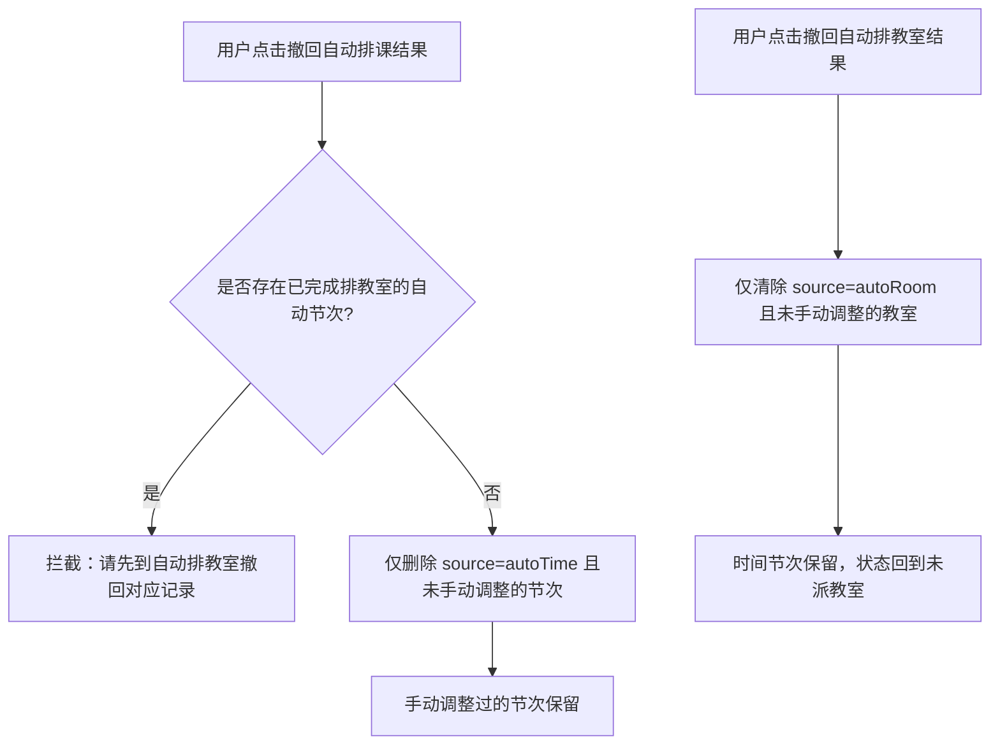

# 自动排课表时间 / 自动排课表教室 · 改动方案

> 文档性质：产品改动方案（需求整理 · 实现指引）  
> 适用范围：排课管理侧栏、自动排规则页、自动排作业页  
> 状态：关键规则已确认 / 原型已落地（P0–P2 菜单、规则、定时器作业流、撤回）  
> 关联现状：手动「排课表时间 / 排课表教室」、`排课规则设置`、`排课时间设置`、冲突类型说明  
> 关联文档：[排课表时间与排课表教室菜单改动方案.md](./排课表时间与排课表教室菜单改动方案.md)、[排课与排教室冲突类型说明.md](./排课与排教室冲突类型说明.md)

---

## 1. 背景与目标

手动排已拆为两阶段：

| 阶段 | 现状入口 | 业务结果 |
|------|----------|----------|
| 排课表时间 | 按入学批次排 / 按教师排 / 按课程排 | 落时间 → 提交至教室侧 |
| 排课表教室 | 按时间排 / 按场地类型排 等 | 派教室 → 可发布/查询 |

本期在两阶段旁各增加**自动排**能力，目标：

| # | 目标 |
|---|------|
| G1 | 在「排课表时间」后新增一级菜单 **自动排课表时间**，下挂自动排课规则设置与自动排课 |
| G2 | 在「排课表教室」后新增一级菜单 **自动排课表教室**，下挂自动排教室规则设置与自动排教室 |
| G3 | 自动排页面支持：范围查询、执行排课、撤回结果、查看进度、查看结果、失败明细与原因 |
| G4 | 自动排规则与手动排冲突/规则口径对齐，失败原因可回落到已知冲突类型 |
| G5 | 时间侧 / 教室侧菜单、页面、状态、任务互不共用（延续两侧独立性约定） |

### 1.1 已确认产品规则

| # | 议题 | 确认结论 |
|---|------|----------|
| C1 | 二级菜单命名 | **自动排课规则设置** / **自动排教室规则设置**（避免与基础「排课规则设置」重名） |
| C2 | 自动排完后提交 | **静默提交**：自动排时间成功明细自动提交至教室侧；自动排教室成功明细按教室侧完成态落库，无需再点提交 |
| C3 | 覆盖策略 | **仅追加未排**：只对未排记录补排；**不修改**已排记录（含手动排、历史自动排） |
| C4 | 再次自动排 | 若要对已自动排范围重排，须先**撤回自动排结果**，再执行自动排 |
| C5 | 手动调整 | 手动排页面可对自动排结果进行增删改调整 |
| C6 | 撤回范围 | 撤回自动排结果时：**不撤回**已被手动调整过的记录；**不撤回**已完成排教室的数据 |
| C7 | 撤回顺序 | 须先撤回排教室记录，再撤回排课（时间）记录；顺序不满足则拦截并提示 |
| C8 | 自动排粒度 | 时间侧：**学时单元**（课程 + 小组/教学班 + 学时类型）；教室侧：**已排节次**（单条 `timeSlot`） |
| C9 | 进度演示 | 原型用 **定时器模拟** 进度与成败样例（非真实引擎） |

### 1.2 非目标

| 项 | 说明 |
|----|------|
| 不替代手动排 | 自动排是并行能力；手动入口与详情交互保持不变，且可调整自动结果 |
| 不重构现有基础设置 | `排课时间设置`、现有 `排课规则设置`（午休/节次上限等）继续服务手动与自动共用约束 |
| 不在本期实现真实排课引擎算法细节 | 原型先落菜单、页面壳、作业流、结果/失败展示；进度用定时器模拟 |
| 不合并时间/教室自动任务 | 自动排时间任务与自动排教室任务分库分状态 |

---

## 2. 菜单结构

### 2.1 改后侧栏（节选）

```
排课管理
├── 操作流程图
├── 【分组】排课基础设置
│   ├── 课表节次维护
│   ├── 排课时间设置
│   └── 排课规则设置              ← 现有：手动/自动共用的基础约束规则
├── 【分组】排课表时间             ← 手动排时间
│   ├── 按入学批次排
│   ├── 按教师排
│   └── 按课程排
├── 【分组】自动排课表时间         ← 新增一级
│   ├── 自动排课规则设置          ← 二级1
│   └── 自动排课                  ← 二级2
├── 【分组】排课表教室             ← 手动排教室
│   ├── 按时间排
│   ├── 按场地类型排
│   └── 课表冲突查询
├── 【分组】自动排课表教室         ← 新增一级
│   ├── 自动排教室规则设置        ← 二级1
│   └── 自动排教室                ← 二级2
├── 【分组】课表查询
└── 【分组】调课管理
```

### 2.2 菜单与页面对照

| 一级菜单 | 二级菜单 | 建议 data-page | 页面定位 |
|----------|----------|----------------|----------|
| 自动排课表时间 | 自动排课规则设置 | `schedule-auto-time-rule` | 维护自动排时间规则 |
| 自动排课表时间 | 自动排课 | `schedule-auto-time` | 范围查询 → 启动/撤回 → 进度/结果/失败 |
| 自动排课表教室 | 自动排教室规则设置 | `schedule-auto-room-rule` | 维护自动排教室规则 |
| 自动排课表教室 | 自动排教室 | `schedule-auto-room` | 范围查询 → 启动/撤回 → 进度/结果/失败 |

### 2.3 命名对照

| 现有菜单 | 新菜单 | 差异 |
|----------|--------|------|
| 排课基础设置 · 排课规则设置 | 自动排课表时间 · 自动排课规则设置 | 前者全局基础约束；后者自动排时间策略 |
| — | 自动排课表教室 · 自动排教室规则设置 | 自动排教室策略，与时间侧自动规则独立 |

---

## 3. 与手动排页面的对齐关系

| 能力点 | 手动排时间 | 自动排课 | 手动排教室 | 自动排教室 |
|--------|------------|----------|------------|------------|
| 范围入口 | 按批次/教师/课程列表查询 | 作业页范围查询 | 按时间/场地类型等列表 | 作业页范围查询（已排时间且未派教室） |
| 核心动作 | 详情页点格落时间 | 仅对**未排学时单元**追加排时间 | 详情页待定/锁定派教室 | 仅对**未派教室节次**追加派教室 |
| 约束来源 | 排课时间设置 + 基础排课规则 + 冲突检测 | 同上 + 自动排课规则 | 教室三类冲突 | 同上 + 自动排教室规则 |
| 结果落库 | 写 `timeSlots` | 同结构写入，`source=autoTime`，并**静默提交**教室侧 | 写 `slot.room` | 同结构写入，`source=autoRoom`，完成态落库 |
| 覆盖策略 | 可改任意未锁定节次 | **不改已排**；要重排须先撤回自动结果 | 可改未完成教室安排 | **不改已派教室**；要重派须先撤回自动排教室结果 |
| 撤回 | 取消所选时段 | 仅撤仍属自动且未被手动改过、且未完成排教室的记录 | 撤回待定/清空教室 | 仅撤仍属自动且未被手动改过的派教室结果 |
| 冲突呈现 | 格子着色 + 弹窗 | 失败记录 + 原因 | 教室格着色 + 弹窗 | 失败记录 + 原因 |
| 互操作 | 可调整自动排结果 | 自动排不覆盖手动结果 | 可调整自动排教室结果 | 自动排教室不覆盖已派 |

---

## 4. 核心业务规则（已确认）

### 4.1 追加排课（不覆盖）

| 规则 | 说明 |
|------|------|
| 自动排课范围 | 仅学时单元上「未排完 / 仍有未排学时」的部分 |
| 自动排教室范围 | 仅已排时间且「未派教室」的节次 |
| 已排记录 | 无论来源为手动或自动，**一律不修改** |
| 重排路径 | 先按 §4.3 撤回对应自动结果 → 记录回到未排 → 再执行自动排 |

### 4.2 静默提交

| 阶段 | 行为 |
|------|------|
| 自动排课成功明细 | 写入时间节次后**自动提交**至排课表教室侧，无需用户再点「提交」 |
| 自动排课失败明细 | 不提交；留在失败列表 |
| 自动排教室成功明细 | 直接落为已安排教室（完成态），无需二次确认提交 |
| 部分成功任务 | 仅成功明细静默提交/落库；失败明细不计完成 |

### 4.3 撤回规则与顺序

| 规则 | 说明 |
|------|------|
| 可撤回对象 | 仍标记为自动来源（`autoTime` / `autoRoom`），且**未被手动调整**的记录 |
| 不撤回 · 手动调整 | 自动结果一经手动改过（改时间/改教室/删节次后再排等），打标 `manualAdjusted`，撤回任务时跳过 |
| 不撤回 · 已排教室 | 时间侧撤回时，若该节次**已完成排教室**（已有有效 `room` / 锁定完成），**禁止撤回该时间记录** |
| 撤回顺序 | **先撤排教室 → 再撤排课时间**；若仍存在已派教室的自动时间结果，拦截并提示「请先撤回排教室记录」 |
| 撤回排教室 | 仅清除自动派教室结果，时间节次保留 |
| 撤回排课时间 | 仅删除仍可撤的自动时间节次；其未排学时回退为可再自动排 |



### 4.4 手动排与自动排协同

| 场景 | 行为 |
|------|------|
| 自动排完成后 | 用户可在手动排时间/排教室详情中继续调整 |
| 手动修改自动节次 | 该节次标记为手动调整；之后自动撤回不再动它 |
| 手动删除自动节次 | 视为手动调整；空出的未排学时可再被自动追加 |
| 再次自动排 | 只填充当前仍未排部分；已有节次不动 |

### 4.5 自动排粒度（确认）

| 侧 | 粒度 | 定义 | 列表行示例 |
|----|------|------|------------|
| 自动排课 | **学时单元** | 同一课程任务下，按「上课小组/教学班 + 学时类型」汇总的应排学时包 | CDF201 · Group1 · 理论学时 · 已排 0/42 |
| 自动排教室 | **已排节次** | 一条已落点的时间节次（星期+节次+周次） | 周一 1-2 节 · 1-14 周 · 未派教室 |

> 执行时：时间侧按学时单元逐条尝试补齐未排学时；教室侧按未派教室的节次逐条派房。进度计数按上述粒度累加。

### 4.6 进度模拟（原型）

| 项 | 说明 |
|----|------|
| 方式 | `setInterval` / 定时器按明细推进 |
| 展示 | 百分比、已处理/总数、成功数、失败数、当前处理对象文案 |
| 样例 | 预置若干成功/失败明细，失败原因使用冲突类型码 |
| 结束 | 定时器完成后任务置 `success` / `partial` / `failed`，成功明细执行静默提交逻辑 |

---

## 5. 自动排课表时间

### 5.1 自动排课规则设置

| 模块 | 内容建议 | 说明 |
|------|----------|------|
| 规则头 | 规则名称、适用学期、启用状态、优先级 | 支持多套规则，执行时选一或按优先级 |
| 范围默认值 | 默认学院/专业/入学批次/是否含周末 | 供自动排课页带入 |
| 硬约束开关 | 教师冲突、学生冲突、不排课、选修占位、教师只排/不排 | 默认开启 |
| 软约束策略 | 先修、预重修、午休、排课规则、学时超排 | 忽略 / 尽量避开 / 严格禁止 |
| 排课策略 | 连排偏好、日分散/集中、优先上午/下午、周次均匀 | 影响模拟落点顺序 |
| 失败策略 | 遇硬冲突跳过并记失败 / 整单中止 | 默认跳过并记失败 |
| 操作 | 新增、编辑、启用/停用、复制学期规则 | 交互对齐现有规则设置页 |

### 5.2 自动排课（作业页）

| 区域 | 内容 |
|------|------|
| A. 范围查询 | 学年学期、学院、专业、入学批次、课程、教师、排课状态（未排完优先） |
| B. 待排范围列表 | 勾选学时单元行：批次/课程/小组/学时类型/应排/已排/未排/状态 |
| C. 作业操作栏 | 选择自动规则、开始自动排课、撤回结果、刷新进度 |
| D. 进度面板 | 定时器驱动：总单元数、已处理、成功、失败、当前项 |
| E. 结果页签 | 成功结果 / 失败记录 / 全部明细 |

#### 5.2.1 操作与状态机

| 操作 | 前置条件 | 结果 |
|------|----------|------|
| 开始自动排课 | 勾选范围内存在**未排学时** + 已选启用规则 + 在排课窗口内 | 创建 `AutoTimeJob`；仅处理未排部分；定时器推进；成功明细静默提交 |
| 查看进度 | 任务 running/已结束 | 进度区刷新 |
| 撤回排课结果 | 存在可撤的自动时间结果 | 若仍有已排教室则拦截；否则只撤未手动调整且未排教室的自动时间节次 |
| 查看结果/失败 | 任务已结束 | 成功可预览课表；失败展示原因码与文案 |

| 任务状态 | 含义 |
|----------|------|
| `pending` | 已创建未执行 |
| `running` | 定时器推进中 |
| `success` | 范围内未排部分全部成功并静默提交 |
| `partial` | 部分成功（已静默提交）+ 部分失败 |
| `failed` | 全部失败或中止 |
| `revoked` | 可撤部分已撤回（手动调整/已排教室部分保留） |

#### 5.2.2 失败记录字段

| 失败字段 | 说明 |
|----------|------|
| 对象 | 学时单元（课程/小组/学时类型）及拟排信息 |
| 失败原因码 | `teacher` / `student` / `blackout` / `elective` / `teacherSlot` / `prereq` / `retake` / `lunch` / `rule` / `hours` / `noSlot` |
| 失败原因文案 | 与手动弹窗口径一致 |
| 规则来源 | 自动规则 / 基础排课规则 / 排课时间设置 |
| 建议动作 | 改规则、缩范围、转手动排、撤回后重跑 |

---

## 6. 自动排课表教室

### 6.1 自动排教室规则设置

| 模块 | 内容建议 | 说明 |
|------|----------|------|
| 规则头 | 名称、学期、启用、优先级 | 与时间侧结构对称、数据独立 |
| 硬约束 | 教室时间冲突必须避开 | 默认强制 |
| 软约束策略 | 座位数不足、场地类型不一致 | 禁止 / 允许忽略 / 优先匹配 |
| 选房策略 | 座位升序、类型优先、楼栋就近、连续节次同教室 | 对齐手动教室列表排序 |
| 范围默认 | 场地类型、楼栋、座位上下限 | 供作业页带入 |
| 失败策略 | 跳过记失败 / 中止 | 默认跳过 |

### 6.2 自动排教室（作业页）

| 区域 | 内容 |
|------|------|
| A. 范围查询 | 学期、学院/专业/批次、课程、场地类型、排教室状态（未排） |
| B. 待派范围列表 | **已排时间且未派教室**的节次行，勾选执行 |
| C. 作业操作栏 | 选择规则、开始自动排教室、撤回、刷新 |
| D. 进度面板 | 定时器按节次推进 |
| E. 结果页签 | 成功 / 失败 / 全部 |

#### 6.2.1 数据入口与撤回

| 规则 | 说明 |
|------|------|
| 入口 | 仅已排时间且未派教室的节次（含自动排课静默提交转入的数据） |
| 不处理 | 已派教室（锁定完成）节次 |
| 撤回排教室 | 只清除 `source=autoRoom` 且未手动调整的教室；撤后节次回到未派，可供再次自动排教室或手动派 |
| 为撤时间让路 | 若用户要撤自动排课时间，须先在本页撤掉对应自动排教室结果 |

#### 6.2.2 失败原因

| 原因码 | 对应冲突 | 强度 |
|--------|----------|------|
| `roomTime` | 教室时间冲突 | 硬 |
| `roomSeats` | 座位数冲突 | 软 |
| `roomType` | 场地类型不一致 | 软 |
| `noRoom` | 无可用教室 | 硬 |
| `lockedByOther` | 时段已被锁定占用 | 硬 |

---

## 7. 页面交互与原型效果要求

| 要求 | 说明 |
|------|------|
| 视觉与组件 | 查询卡、表格、legend-bar、按钮样式对齐手动排列表页 |
| 两侧独立 | 自动时间 / 自动教室分 page、分 store、分菜单 |
| 进度可见 | 定时器驱动百分比与「已处理/总数」，结束后停留结果页签 |
| 撤回提示 | 顺序错误、无可撤记录、全被手动调整/已排教室占用时给出明确提示 |
| 结果可核对 | 成功行可打开对应手动详情（可编辑，以便调整自动结果） |
| 失败可解释 | 原因文案复用冲突类型说明 |
| 权限与窗口 | 超出排课/排教室起止时间禁用开始并提示 |

### 7.1 建议线框

```
┌─────────────────────────────────────────────┐
│ 标题：自动排课 / 自动排教室                   │
├─────────────────────────────────────────────┤
│ [查询条件卡] 查询 重置                        │
├─────────────────────────────────────────────┤
│ 待排范围表（可多选；仅未排/未派）              │
├─────────────────────────────────────────────┤
│ 规则：〔下拉〕  [开始自动排] [撤回结果] [刷新] │
│ 进度：████████░░  80%  成功120 失败8 …        │
├─────────────────────────────────────────────┤
│ 页签：成功结果 | 失败记录 | 全部明细           │
└─────────────────────────────────────────────┘
```

---

## 8. 数据与流转

### 8.1 关键对象

| 对象 | 用途 |
|------|------|
| `AutoTimeRule` / `AutoRoomRule` | 两侧自动规则 |
| `AutoTimeJob` / `AutoRoomJob` | 一次执行任务 |
| `AutoJobItem` | 明细（成功/失败）；含粒度主键 |
| 节次标记 | `source`：`autoTime` / `autoRoom` / `manual`；`manualAdjusted`：是否经手动改过；`jobId`：来源任务 |

### 8.2 流转关系

| 场景 | 规则 |
|------|------|
| 自动排课成功 | 写未排学时对应的新 `timeSlots`（不改旧节次）→ `source=autoTime` → **静默提交**教室侧 |
| 自动排教室成功 | 仅给未派教室节次写 `room` → `source=autoRoom` |
| 手动调整 | 将触及节次标为 `manualAdjusted=true`（可同时 `source` 保留原值或改为 `manual`，撤回以 `manualAdjusted` 为准） |
| 撤回自动排教室 | 清自动教室字段；时间保留 |
| 撤回自动排课 | 校验无已派教室后，删未手动调整的自动时间节次 |
| 再次自动排 | 只扫描当前未排学时单元 / 未派教室节次 |

### 8.3 进度模型

| 字段 | 说明 |
|------|------|
| `total` | 本任务明细总数（学时单元数或节次数） |
| `done` / `success` / `failed` | 定时器累加 |
| `startedAt` / `finishedAt` | 起止时间 |
| `message` | 如「正在处理 CDF201 · Group1 · 理论学时」 |

---

## 9. 冲突与规则口径复用

| 自动侧展示 | 复用手动冲突类型 | 文档 |
|------------|------------------|------|
| 自动排课失败原因 | 教师/学生/占位三类/先修/预重修/午休/规则/学时等 | 排课与排教室冲突类型说明 · 排时间 |
| 自动排教室失败原因 | 教室时间/座位数/场地类型/无教室 | 同上 · 排教室 |
| 颜色（结果预览课表） | 与手动课表格着色一致 | 同上 · 颜色规范 |

---

## 10. 实施分期建议

| 期次 | 范围 | 交付 |
|------|------|------|
| P0 | 菜单（新二级名）+ 四页壳 + 规则 CRUD + 作业页查询/未排列表 | 可点通导航 |
| P1 | 自动排课：定时器进度、仅追加未排、成功静默提交、失败列表、撤回（含顺序校验） | 时间侧闭环 |
| P2 | 自动排教室：同构 + 教室失败原因 + 先撤教室再撤时间 | 教室侧闭环 |
| P3 | 手动调整打标、与手动详情互通、规则复制学期 | 体验补齐 |

---

## 11. 验收要点

| # | 验收项 |
|---|--------|
| 1 | 侧栏「自动排课表时间」下为：自动排课规则设置、自动排课 |
| 2 | 侧栏「自动排课表教室」下为：自动排教室规则设置、自动排教室 |
| 3 | 自动排只处理未排/未派记录，已排记录不变 |
| 4 | 自动排课成功明细静默提交至教室侧 |
| 5 | 进度由定时器模拟，可看到成功/失败统计 |
| 6 | 失败记录展示原因，口径对齐冲突类型说明 |
| 7 | 撤回不触碰手动调整记录；不撤已排教室的时间数据 |
| 8 | 存在已排教室时撤回排课被拦截，提示先撤排教室 |
| 9 | 手动排页面可打开并调整自动排结果 |
| 10 | 粒度：时间侧学时单元，教室侧已排节次 |
| 11 | 时间/教室自动页互不共用 page 与状态 |

---

## 12. 修订记录

| 日期 | 说明 |
|------|------|
| 2026-08-10 | 初版：菜单、规则页、作业页、与手动排对齐及分期 |
| 2026-08-10 | 确认：二级菜单改名；静默提交；仅追加未排；撤回不含手动调整与已排教室；先撤教室再撤时间；粒度学时单元/已排节次；定时器模拟进度 |
| 2026-08-11 | 原型实现：侧栏四菜单、规则页、自动排课/自动排教室作业流（定时器进度、成功失败、撤回顺序校验） |
