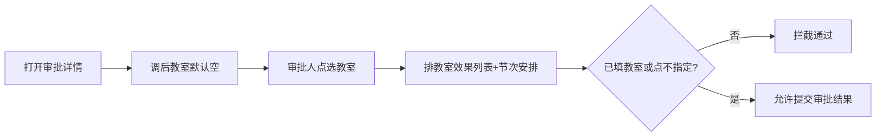

# 调课申请弹窗 · 左右布局与教室偏好改动方案

> 文档性质：代码改动方案（需求整理 · 设计）  
> 适用范围：  
> - 调课管理 → **我的调课申请** / **调课申请管理** → 发起（代发起）申请弹窗  
> - 调课管理 → **调课申请审批** → 审批详情中的调后教室录入  
> 状态：**已评审 / 待实现**  
> 共用申请入口：`#modal-adjustment-apply`（`openAdjustmentApplyModal` / `openAdjustmentAdminApplyModal`）

---

## 1. 背景与目标

### 1.1 现状问题

当前发起调课申请为**右侧抽屉 + 纵向表单**：

| 点 | 现状 |
|----|------|
| 弹窗形态 | `#modal-adjustment-apply` 使用 `modal-drawer`，默认宽约 `640px` |
| 选节次 | 右侧表单内按钮「+ 选择上课节次」→ 再开嵌套抽屉 `#modal-adjustment-slot-picker` |
| 调课明细 | `#adjustment-apply-perslot-list` 以卡片块（`.adj-resch-row`）展示 |
| 教室（申请） | 「目标教室」点选 `#modal-adjustment-room-picker` |
| 节次冲突弹窗 | `#modal-adjustment-conflict` 展示冲突条数/明细，**学生冲突未展示冲突人数** |
| 加课 | 单课程下拉 + **一组**共享目标时间，难以一单多节次连续添加 |
| 加课/补课课程信息 | 缺**课程学分** |
| 审批调后教室 | 详情表直接展示申请侧教室（常为「不指定」或原教室），**审批人无法按排教室列表挑选并默认填空** |

### 1.2 目标

**申请弹窗（教师端 / 管理端共用）：**

1. 弹窗**保留右侧抽屉**，宽度约页面 **2/3**。  
2. **左右结构**：左选节次/课程列表，右调课设置表格。  
3. **勾选即同步**；明细为**表格**；申请侧「目标教室」→「**教室偏好**」输入框；历史展示同步改文案。  
4. 左栏查询增加**周次、日期范围**；上课小组拼接**人数**；右栏原上课时间含**日期**、小组含**人数**。  
5. **加课**左栏改为可选列表；支持**添加节次**、**连续添加**，**一单多个加课节次**。  
6. **加课 / 补课**课程信息增加**课程学分**。  
7. 选择目标节次触发的**冲突提醒弹窗**增加展示**学生冲突人数**。  
8. 删除申请路径对 `#modal-adjustment-room-picker` 的相关代码。

**审批（调课申请审批）：**

9. **调后教室默认空**，由审批人选择填入（或明确「不指定教室」）。  
10. 选教室弹窗效果对齐**排教室界面教室列表**（可见教室信息 + **节次安排/占用**）。  
11. 审批通过前校验：每条需**已录入教室**或已选**不指定教室**。

### 1.3 非目标（本期不做）

| 项 | 说明 |
|----|------|
| 列表页查询列大改 | 「我的调课申请 / 管理 / 审批」列表主表结构不变 |
| 批量调课精确换教室 | `#modal-adjustment-batch` 仍走自有精确教室逻辑；若曾复用申请教室抽屉，改为复用排教室选择器或独立实现 |
| 后端接口正式迁移 | 原型可用 `roomPrefer` / `approveRoom`；正式字段另评 |

---

## 2. 现状结构（改前）

### 2.1 入口

```
我的调课申请   → openAdjustmentApplyModal(type)
调课申请管理   → openAdjustmentAdminApplyModal(type) → openAdjustmentApplyModal(type, true)
调课申请审批   → openAdjustmentDetail(id, true) → renderAdjustmentDetailInfoTable(..., { editable: true })
```

类型：`reschedule` / `cancel` / `makeup` / `addclass`。

### 2.2 关键代码位置

| 模块 | 位置 |
|------|------|
| 申请弹窗 | `index.html` `#modal-adjustment-apply`；`openAdjustmentApplyModal`、`renderAdjustmentPerSlotConfigs` |
| 选节次抽屉 | `#modal-adjustment-slot-picker`（迁入左栏后降级/删除） |
| 申请教室抽屉 | `#modal-adjustment-room-picker` ← **申请相关删除** |
| 冲突弹窗 | `#modal-adjustment-conflict`；`openAdjustmentConflictPopup`、`renderAdjustmentConflictLines` |
| 审批详情表 | `renderAdjustmentDetailInfoTable`（调后「教室」列只读展示 `t.room`） |
| 排教室列表/选择 | `getScheduleRoomTimetableRows`、`#modal-schedule-room-picker`、`renderScheduleRoomModalRows` |
| 密度冲突人数 | `confirmAdjustmentDensitySelection` 已有「N 个学生冲突」口径，可复用统计思路 |

---

## 3. 目标结构（改后）

### 3.1 申请弹窗骨架

```
#modal-adjustment-apply（右侧抽屉，宽 ≈ 2/3）
├── head
├── body .adj-apply-split
│     ├── 左栏：筛选 + 可选列表（勾选即同步）
│     └── 右栏：设置标题 + 明细表 +（加课）添加节次 + 事由/附件
└── foot：取消 / 提交
```

### 3.2 勾选即同步（已确认）


### 3.3 审批选教室（新增）



---

## 4. 需求明细与设计约定

### 4.1 弹窗宽度与形态（已确认）

| 项 | 约定 |
|----|------|
| 形态 | **保留 `modal-drawer`**，仅加宽 |
| 宽度 | `min(1200px, 66.666vw)`，仅作用于 `#modal-adjustment-apply` |

### 4.2 左右布局与各类型（已确认）

| 类型 | 左栏 | 右栏 |
|------|------|------|
| 调课 / 停课 | 已排节次列表 | 明细表（停课无目标列或只读原信息） |
| 补课 | 停课记录列表 | 明细表（含学分，见 §4.8）+ 目标字段 + 教室偏好 |
| 加课 | **课程/上课小组可选列表** | 已选课程信息（含学分）+ **多节次明细** + **添加节次** + 教室偏好/事由 |

### 4.3 左栏查询增强

| 条件 | 说明 |
|------|------|
| 周次 | 与排课周次解析交集过滤 |
| 日期范围 | 节次推算日期落在起止闭区间；可单边 |

顺序示意：`课程 | 教师 | 上课小组 | 周次 | 日期范围` → `星期 | 教室 | 查询/重置`。

### 4.4 上课小组拼接人数

展示 **`小组名（N人）`**；人数来源对齐开课分组/`studentCount`（可抽 `getAdjustmentGroupStudentCount`）。左栏列表与右栏原课信息一致。

### 4.5 右栏明细表格 + 原信息

- 去卡片，用 `.adj-apply-detail-table`。  
- 原上课时间：**日期 · 周次 · 星期 · 节次**。  
- 上课小组：**名（人数）**。  
- 申请侧教室字段为**教室偏好**输入框（见 §4.6）。

### 4.6 申请侧：目标教室 → 教室偏好

| 项 | 约定 |
|----|------|
| 控件 | 文本输入，可选 |
| 历史 | 标签统一「教室偏好」；历史精确教室号内容原样展示 |
| 冲突 | 偏好文案**不参与**精确场地冲突 |
| `#modal-adjustment-room-picker` | **删除申请相关代码**（审批另建/复用排教室选择器，见 §4.10） |

### 4.7 冲突提醒弹窗：学生冲突人数（新增）

触发点（保持现逻辑）：选择/变更目标节次等导致学生冲突时 `openAdjustmentConflictPopup(val, 'student')`。

| 项 | 约定 |
|----|------|
| 展示 | 在学生冲突区块增加**冲突人数**，如：`学生冲突：发现 K 处 · 涉及约 N 人` |
| 人数口径 | 优先按冲突对方上课小组人数汇总（去重规则：同一学生不重复计；原型可按冲突课程小组 `studentCount` 求和，并标注「约」）；可与课表密度单元格人数统计思路对齐 |
| 明细 | 原有冲突课程/节次明细行保留；人数可挂在标题行或每条明细后 `（约 n 人）` |
| 密度确认 | `confirmAdjustmentDensitySelection` 已有人数提示，文案口径与弹窗尽量一致 |

关键函数：`renderAdjustmentConflictLines`、`checkAdjustmentConflictForVal`、`openAdjustmentConflictPopup`；结果结构可扩展 `studentCount` / `studentConflictHeadcount`。

### 4.8 加课 / 补课：课程信息增加学分（新增）

| 界面 | 约定 |
|------|------|
| 加课 | 左栏列表与右栏已选课程信息增加**课程学分**列/字段 |
| 补课 | 左栏停课记录行、右栏原课信息增加**课程学分** |
| 数据 | 从开课任务 / 课程库 `credits` 读取（如 `task.credits` / catalog） |

### 4.9 加课：添加节次 · 连续添加 · 一单多节次（新增）

改前：加课仅一组共享目标时间。  

改后：

| 项 | 约定 |
|----|------|
| 选课 | 左栏勾选课程/小组同步到右栏（可多门，或一期限制一门+多节次——**默认允许一门课程下挂多节次；若勾选多门则每门各自可添加节次**） |
| **添加节次** | 右栏提供「+ 添加节次」；每点一次在明细表**追加一行**目标时间（日期/周次/星期/节次/教室偏好等） |
| **连续添加** | 添加后不关闭设置区，可连续点「添加节次」；新行可带出上一行部分默认值（如同一周、下一节）以便连排，允许改 |
| **一单多节次** | `submitAdjustmentApply` 将多行 `to` 写入同一申请的 `items[]`，`slotCount` = 节次数 |
| 移除 | 每行可删；至少保留 1 个节次才可提交（或 0 节次时提交拦截） |
| 冲突 | 按行检测；学生冲突弹窗带人数（§4.7） |

状态示意：

```js
// 加课：已选课程 + 多节次
adjustmentAddclassCourses = [{ taskId, code, name, credits, group, studentCount, ... }]
adjustmentAddclassSlots = [
  { id, date, weekday, period, weeks, roomPrefer, teacherId, conflict },
  ...
]
```

### 4.10 审批：调后教室默认空 · 审批人选教室（新增）

适用范围：`reschedule` / `makeup` / `addclass` 等需落地教室的类型；`cancel` 不适用。

| 项 | 约定 |
|----|------|
| 默认值 | 审批详情「调后安排 · 教室」**默认为空**（不回填申请偏好为正式教室；偏好可另列只读「教室偏好」供参考） |
| 录入方式 | 审批人点击单元格/按钮打开**选教室弹窗**填入；或点「不指定教室」写入明确标记（如 `room = ''` 且 `roomUnspecified = true`） |
| 与申请偏好关系 | 申请「教室偏好」仅提示，**不自动变成**调后教室 |
| 可改节次 | 保留现有审批改调后节次能力 |

详情表头建议：

- 调后安排列：「教室」→ 展示录入结果；另可增加只读「教室偏好」（来自申请）。  
- 或：教室列空时显示占位「请选择教室」，旁挂「选择」「不指定」。

### 4.11 审批选教室弹窗 = 排教室教室列表效果（新增）

| 项 | 约定 |
|----|------|
| 效果对齐 | 与**排教室界面教室列表**一致：可见教室号、楼栋、楼层、有效座位、场地/教室类型、设备、软件等 |
| 节次安排 | 能看到教室在目标星期/节次/周次下的**占用与安排情况**（复用/适配 `getScheduleRoomTimetableRows` 或排教室列表行的占用展示；选中行可展开/侧栏显示该教室课表片段） |
| 实现策略（推荐） | **复用** `#modal-schedule-room-picker` + `renderScheduleRoomModalRows` 能力并扩展「按目标时间显示占用」；审批上下文通过参数传入目标 `weekday/period/weeks`；**不要**复活已删除的申请用 `#modal-adjustment-room-picker` |
| 页脚 | 「不指定教室」/「确定」/「取消」 |

参考：排教室详情教室列表与 `#modal-schedule-room-picker`（`prototype/参考文档/.../排教室界面教室列表与占用交互改动方案.md`）。

### 4.12 审批校验：已录入教室或选择不指定（新增）

| 项 | 约定 |
|----|------|
| 时机 | 审批「通过」或录入审批结果提交时（`openAdjustmentReview` / 确认通过逻辑） |
| 规则 | 每条需落地的明细：`已选择具体教室` **或** `已标记不指定教室`；否则 `alert` 拦截并定位未填行 |
| 空串 | 默认空 **≠** 不指定；必须显式点「不指定教室」才算完成 |
| 驳回 | 驳回可不强制填教室 |

### 4.13 评审结论汇总

| # | 议题 | 结论 |
|---|------|------|
| 1 | 选节同步 | 勾选即同步 |
| 2 | 明细形态 | 表格 |
| 3 | 弹窗形态 | 保留抽屉，仅加宽 |
| 4 | 加课左栏 | 可选列表 |
| 5 | 历史教室文案 | 同步为教室偏好 |
| 6 | 申请教室抽屉 | 删除申请相关代码 |
| 7 | 冲突弹窗 | **增加学生冲突人数** |
| 8 | 加课节次 | **添加节次 / 连续添加 / 一单多节次** |
| 9 | 加课·补课 | **课程信息增加学分** |
| 10 | 审批教室 | **默认空，审批人选**；弹窗=排教室列表效果；须已填或「不指定」 |

---

## 5. 实现要点（按文件）

### 5.1 `index.html`

1. `#modal-adjustment-apply` 左右分栏；左栏筛选含周次、日期范围。  
2. 加课右栏增加「+ 添加节次」按钮与多节次表容器。  
3. 申请侧教室偏好改为 input；删除 `#modal-adjustment-room-picker`（申请用）。  
4. 冲突弹窗容器可增加人数展示节点（或纯 JS 注入）。  
5. 审批选教室：复用/增强 `#modal-schedule-room-picker`（增加「不指定教室」、占用提示区），勿新建一套简陋列表。

### 5.2 `styles.css`

| 改动 | 说明 |
|------|------|
| 申请抽屉 2/3 宽 + 左右分栏 + 明细表 | 同前 |
| `.adj-conflict-*` | 人数强调样式（可选） |
| 审批教室空态 / 选择按钮 | 单元格内操作样式 |
| 选教室占用预览 | 若弹窗内嵌课表条，复用排教室相关 class |

### 5.3 `app.js`（申请）

| 点 | 改动 |
|----|------|
| 左栏/右栏/勾选同步/人数/日期/教室偏好 | 同前版 §5.3 |
| `renderAdjustmentConflictLines` / `openAdjustmentConflictPopup` | 计算并展示学生冲突人数 |
| 加课状态 | `adjustmentAddclassSlots[]`；`addAdjustmentAddclassSlot` / `removeAdjustmentAddclassSlot` |
| `submitAdjustmentApply`（加课） | 多节次写入 `items` |
| 学分 | 加课/补课行带 `credits` 展示 |
| 删除申请 room picker 函数与引用 | 同前 |

### 5.4 `app.js`（审批）

| 点 | 改动 |
|----|------|
| `renderAdjustmentDetailInfoTable` | 调后教室默认空；可编辑时渲染选择/不指定；只读展示教室偏好 |
| `openAdjustmentApproveRoomPicker(reqId, itemIdx)` | 打开排教室效果选择器，带入该行目标时间 |
| `confirm` / `clearUnspecified` | 写回 `items[i].to.room` 与 `roomUnspecified` |
| 审批提交校验 | `assertAdjustmentApproveRoomsReady(r)`：未完成则拦截 |
| 冲突单元格 | 审批改教室后可重算场地冲突（有精确教室时） |

### 5.5 状态字段建议

```js
// 申请 perSlot / 加课节次
{ date, weekday, period, weeks, teacherId, roomPrefer, credits? }

// 审批落库（明细 to）
{
  ...,
  room: '',              // 审批录入的教室号；默认空
  roomUnspecified: false,// true 表示明确不指定
  roomPrefer: '...'      // 申请带来的偏好，只读展示
}
```

---

## 6. 交互与验收清单

### 6.1 申请

- [ ] 抽屉约 2/3 宽；左右布局；勾选即同步；明细表格  
- [ ] 周次/日期范围过滤正确；小组含人数；原时间含日期  
- [ ] 教室偏好输入；无申请 `#modal-adjustment-room-picker`  
- [ ] 选节次学生冲突弹窗展示**冲突人数**  
- [ ] 加课/补课展示**课程学分**  
- [ ] 加课可连续「添加节次」，一单提交多条加课节次  

### 6.2 审批

- [ ] 调后教室默认空；可见申请教室偏好（只读）  
- [ ] 选教室弹窗具备排教室列表级信息，并能看到节次安排/占用  
- [ ] 可「不指定教室」；默认空不能当作已不指定  
- [ ] 未录入且未不指定时，通过审批被拦截  
- [ ] 驳回不强制教室  

### 6.3 回归

- [ ] 调后日期/节次/教师/密度回填  
- [ ] 教室偏好不误报场地冲突  
- [ ] 排教室/批量调教室选择器未被误删  
- [ ] 窄屏可操作  

---

## 7. 实施步骤建议

| 步骤 | 内容 | 预估 |
|------|------|------|
| 1 | 申请：抽屉加宽 + 左右分栏 + 表格明细 + 教室偏好 | 中 |
| 2 | 左栏周次/日期/人数；勾选同步；删申请 room picker | 中 |
| 3 | 冲突弹窗学生冲突人数 | 小 |
| 4 | 加课/补课学分；加课添加节次与一单多节次 | 中 |
| 5 | 审批：调后教室空态 + 排教室效果选教室 + 不指定 | 中 |
| 6 | 审批通过校验；详情文案历史偏好 | 小 |
| 7 | 四类型申请 + 审批 + 排教室选择器回归 | 中 |

---

## 8. 改动影响面小结

| 文件 | 影响 |
|------|------|
| `prototype/index.html` | 申请左右布局；加课添加节次；删申请教室抽屉；冲突/选教室弹窗微调 |
| `prototype/styles.css` | 分栏、明细表、冲突人数、审批教室空态 |
| `prototype/app.js` | 申请全流程 + 冲突人数 + 加课多节次 + 审批选教室/校验 |

---

## 9. 实现依据

实现以本文 **§4（含 §4.7–§4.13）** 为准。若实现中需微调（如加课是否允许一单多门课程），先回写本文再改代码。
