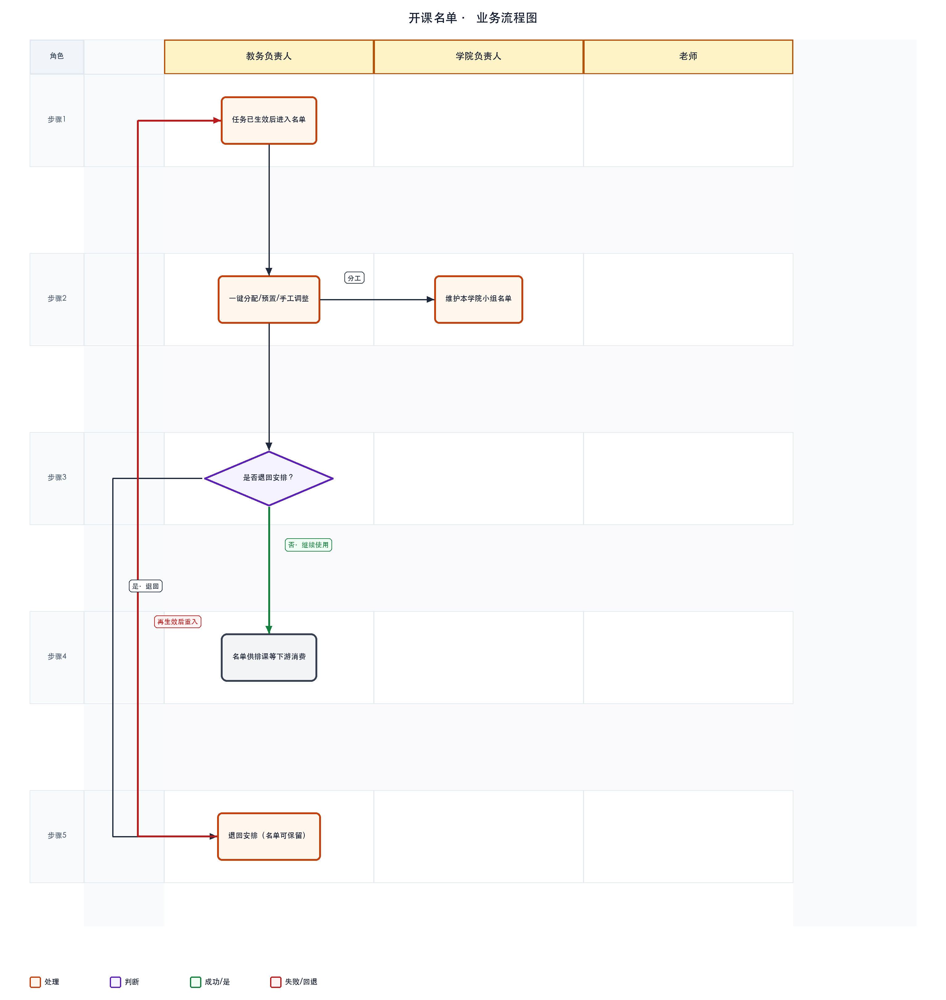
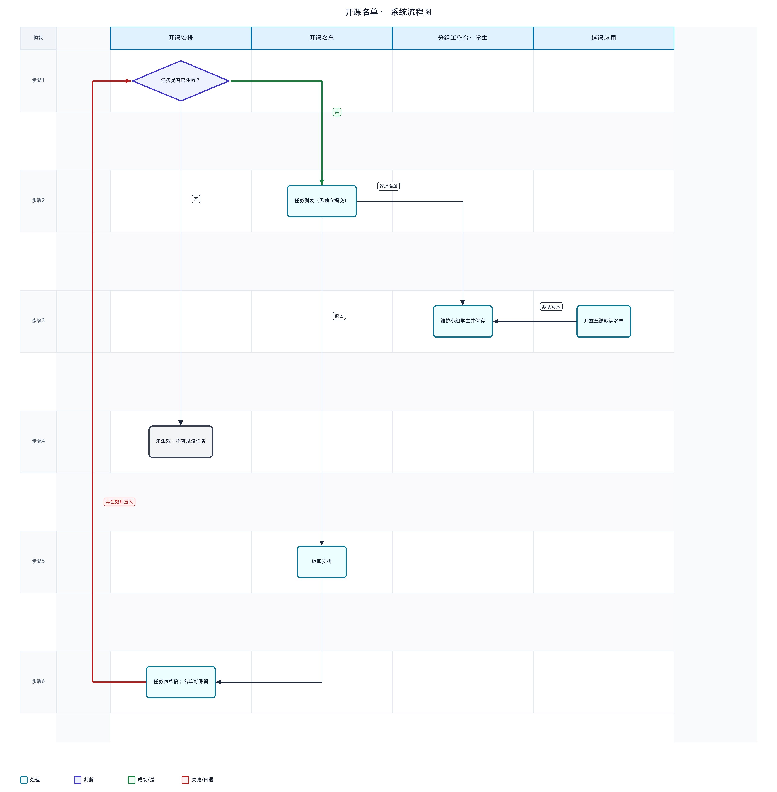

# 开课名单 · 详细设计

> 依据：可交互原型（`page-course-major-offering-roster`、`page-offering-grouping` 学生名单 Tab）、需求文档《开课名单20260804V2》、概要设计《开课名单概要设计20260807V1》、跨模块依据笔记。

---

## 1. 文档信息

| 项 | 内容 |
|----|------|
| 文档名称 | 开课名单详细设计 |
| 菜单路径 | 开课管理 → 专业开课 → 开课名单 |
| 版本 | V1 |
| 日期 | 2026-08-07 |
| 填写人 | |
| 确认人 | |
| 确认状态 | 草稿 |
| 对应概要设计 | `../开课名单概要设计20260807V1/开课名单概要设计20260807V1.md` |
| 依据 | 原型；PRD `开课名单20260804V2`；依据笔记 §可见范围、§无独立提交 |

## 2. 设计约定

| 约定项 | 说明 |
|--------|------|
| 术语 | **可见范围**：计划已生效 **且** 任务安排已生效；**退回安排**：名单页批量退回至开课安排（非退回计划）；**无独立提交**：本页无「提交名单」按钮，进入维护阶段即依赖上游任务已生效 |
| 状态口径 | 本页**无**独立名单工作流状态（无 draft/submitted）；依赖任务 `submitStatus`；名单变更通过保存/移除记录体现 |
| 权限口径 | 教务：查询、管理名单、退回、操作记录；学院：分组环节设小组上限与需求说明，参与名单维护（按权限） |
| 数据来源口径 | 预置名单来自培养/学籍；开放选课默认名单来自选课应用；小组上限来自分组工作台 |

## 2.1 业务流程图（按角色泳道）

> 泳道按**角色**划分：教务负责人、学院负责人、老师。不参与步骤的泳道留空。圆角矩形为处理，菱形为判断，灰框为说明或结束。
> **绿色箭头/标签**表示通过或成功分支；**红色箭头/标签**表示失败、否决或回退，并标明回到哪一步。



## 2.2 系统流程图（按模块 / 菜单 / 功能泳道）

> 泳道按**系统模块、菜单或功能**划分，描述模块间数据与控制流转。
> 同样用绿/红标注成功与失败回退路径（例如开课安排生效失败 → 回到分组/教师确认补齐）。



## 3. 页面结构

### 3.1 主页面

- **区域划分**：页头（含流程说明，可折叠）→ 筛选区 → 工具栏 → 列表
- **可见范围（硬约束）**：列表仅展示 **计划已生效 且 任务安排已生效** 的开课任务；允许空态进入页面
- **页内提示要点**：
  - 任务安排生效后按开课任务展示；「管理名单」进分组页维护学生
  - **无独立「提交名单」**；流程图「提交到开课名单」语义 = 不可跳过授课确认而进入名单维护
  - 开放选课默认由选课应用生成，仍可手动管理（边界待确认）
  - 老生：计划人数=预置规模，名单不改计划人数/上限；新生：计划人数=招生计划

### 3.2 弹窗 / 抽屉 / 子页

| 名称 | 触发方式 | 用途 |
|------|----------|------|
| 学生名单概览 | 列表「人数」 | 抽屉只读/筛选查看 |
| 管理名单 · 分组工作台 | 行操作 | Tab「学生名单」：维护各小组学生 |
| 一键分配 | 工作台工具栏 | 按规则批量入组 |
| 预置名单 | 工作台 | 从预置可修池分配 |
| 添加学生 / 调整分组 / 移除 | 工作台 | 手工维护 |
| 名单移除记录 | 工作台 | 审计已移除学生 |
| 保存名单 | 工作台 | 持久化当前维护结果 |
| 退回说明 | 列表工具栏「退回」 | 退回至开课安排，必填 |

## 4. 查询与列表

### 4.1 筛选项

| 筛选项 | 控件类型 | 说明 |
|--------|----------|------|
| 学年学期 | 下拉 | — |
| 上课学院 | 下拉 | 全部 |
| 上课专业 | 下拉 | 全部 |
| 开课单位 | 下拉 | — |
| 课程号 | 文本 | — |
| 查询 / 重置 | 按钮 | — |

### 4.2 列表列

| 列名 | 说明 | 备注 |
|------|------|------|
| 勾选 | 批量退回 | — |
| 开课学期 / 课程号/名称 | — | — |
| 选课类型 | 开放/不开放 | 决定名单来源主路径 |
| 教师 / 教师数 / 小组数 | 摘要 | — |
| Prog. Batch | 专业+批次 | 合班多行 |
| 学分 / 总学时 / 开课单位 / 起止周 | — | — |
| 人数 | 链接 | 打开名单抽屉 |
| 操作记录 | 链接 | — |
| 管理名单 | 按钮 | 进工作台 Tab |

### 4.3 排序 / 分页 / 批量选择

- 工具栏：**退回**（勾选，填说明）
- 工作台名单表：勾选｜序号｜学号｜姓名｜性别｜国籍｜学生类别｜专业｜入学批次｜课程班/小组｜学籍状态｜学籍类型｜来源

## 5. 关键动作

| 动作 | 入口 | 前置条件 | 结果 | 备注 |
|------|------|----------|------|------|
| 管理名单 | 行操作 | 计划已生效且任务已生效 | 进入分组工作台·学生名单 Tab | 主入口 |
| 保存名单 | 工作台 | — | 保存维护结果 | 可提示自动保存 |
| 一键分配 | 工作台 | 有未分配学生/预置 | 按规则批量入组 | 见 §6 |
| 预置名单 / 添加学生 | 工作台 | 组容量未满 | 写入小组 | 受上限约束 |
| 调整分组 / 移除 | 工作台 | 已选学生 | 调组或移出 | 移除留记录 |
| **退回**（至安排） | 列表工具栏 | 已勾选 | 任务→草稿；**名单可保留** | 与安排页「撤回」不同 |
| 查看人数 | 列链接 | — | 抽屉概览 | — |

**明确不存在**：工具栏/行操作均无「提交名单」「确认名单」类按钮；名单阶段由上游任务生效触发。

## 6. 校验与业务规则

### 6.1 可见与前置

| 编号 | 规则 | 触发时机 | 不满足时表现 |
|------|------|----------|--------------|
| R1 | 可见条件：计划已生效 **且** 任务已生效 | 列表加载 | 未生效任务不出现 |
| R2 | 无独立提交名单流程 | — | 不提供提交按钮 |
| R3 | 实际人数 ≤ 小组人数上限 | 添加/分配/调组 | 拦截或提示容量不足 |
| R4 | 名单维护不改计划人数/名额上限（老生） | 保存 | 只改组内分配 |
| R5 | 新生批次无预置时以招生计划为计划人数口径 | 展示 | 批次暂无预置名单 |

### 6.2 一键分配

| 场景 | 行为 |
|------|------|
| 无平行小组（名单仍在课程班层） | 按专业+入学批次匹配，批量导入该班 |
| 已拆平行小组 | 配置维度（国籍类型、专业、intake、性别等）与模式（等比例/顺序/唯一值）；无法入组者提示 |

### 6.3 退回安排 vs 安排页撤回（必须区分）

| 操作 | 发起页 | 任务状态 | 合班/分组/教师 | 学生名单 |
|------|--------|----------|----------------|----------|
| **退回安排** | **本页** | → 草稿（安排可改） | 保留，可再改安排 | **保留** |
| **撤回** | 开课安排页 | → 草稿 | 保留 | **小组分配重置** |
| 退回至计划 | 开课安排页 | 计划回退+清安排 | 清空安排侧 | 清空安排侧 |

- 名单页退回须填**退回说明**
- 与「退回至开课计划」不同：后者清合分班/分组/教师，本操作仅回到安排层

### 6.4 开放选课

默认名单来自选课应用；页内提示「开放选课名单由选课应用生成」；是否允许开课侧手工改的最终边界待确认。

## 7. 状态流转

```text
（上游）任务已生效 ──► 本页可见、可维护名单
        │
        ├──保存/分配/调组──► 名单数据更新（无独立提交态）
        │
        ├──本页「退回安排」──► 任务草稿（名单保留，安排可改）
        │
        └──安排页「撤回」──► 任务草稿（小组分配重置，与退回不同）
```

| 关联操作 | 任务状态 | 名单 |
|----------|----------|------|
| 安排页生效 | 已生效 | 可开始维护 |
| 本页退回安排 | 草稿 | **保留** |
| 安排页撤回 | 草稿 | 小组分配**重置** |

## 8. 数据对象（原型已知）

| 对象 / 字段 | 含义 | 来源 / 备注 |
|-------------|------|-------------|
| 开课任务行 | 列表一行教学班 | 已知 · 上游安排 |
| 小组人数上限 / 需求说明 | 分组环节设定 | 已知 · 工作台侧栏 |
| 名单学生行 | 学号、姓名、组、来源等 | 已知 · 预置/手工/选课/一键分配 |
| 名单来源 | 预置、手工、选课应用等 | 已知 · 只读展示 |
| 移除记录 | 已移除学生审计 | 已知 · 抽屉 |
| revertRemark | 退回说明 | 已知 · 退回必填 |

## 9. 上下游与跨模块约束

| 方向 | 模块 | 关系说明 |
|------|------|----------|
| 上游 | 开课计划 | 须 **计划已生效**（与任务生效共同构成可见条件） |
| 上游 | 开课安排 | 须 **任务已生效**；生效门槛含分组合法、有教师、确认齐套 |
| 上游 | 分组容量 / 预置名单 | 上限与可修池 |
| 外部 | 选课应用 | 开放选课默认名单 |
| 协同 | 分组工作台 | 学生名单 Tab 与安排侧共用 |
| 旁路 | 名单变更日志 / 移除记录 | 审计 |
| 下游 | 排课 / 考勤等 | 消费稳定名单 |
| 并行 / 约束 | 主链路末段 | 不可跳过授课确认进入本页维护 |

## 10. 异常与提示

| 场景 | 提示或处理 |
|------|------------|
| 退回未勾选 | 请先选择 |
| 退回说明为空 | 阻止提交 |
| 超小组上限 | 提示剩余可分配名额 |
| 一键分配无法入组 | 显式提示，不静默丢弃 |
| 开放选课 | 工具栏提示名单主来源为选课应用 |

## 11. 待确认清单

| 编号 | 事项 | 阻塞程度 |
|------|------|----------|
| 1 | 开放选课是否允许开课侧手工改名单的最终边界 | 高 |
| 2 | 学籍异动写入名单的生效学期规则 | 中 |
| 3 | 一键分配与预置名单冲突时的优先级提示 | 低 |
| 4 | 页内流程说明是否默认折叠 | 低 |
