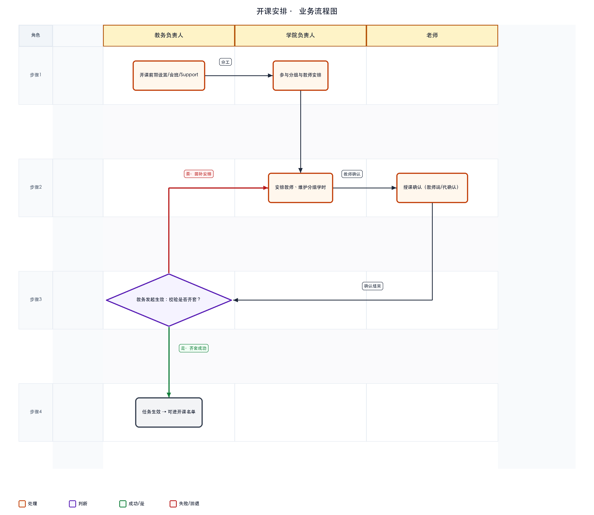
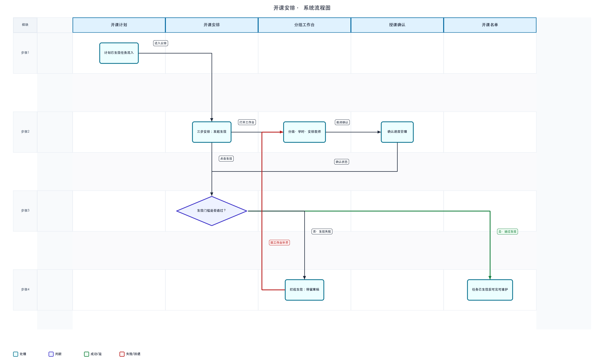

# 开课安排 · 详细设计

> 依据：可交互原型（`page-course-major-offering-task-style2`）、需求文档《开课安排20260804V4》、概要设计《开课安排概要设计20260807V1》、跨模块依据笔记。

---

## 1. 文档信息

| 项 | 内容 |
|----|------|
| 文档名称 | 开课安排详细设计 |
| 菜单路径 | 开课管理 → 专业开课 → 开课安排 |
| 版本 | V1 |
| 日期 | 2026-08-07 |
| 填写人 | |
| 确认人 | |
| 确认状态 | 草稿 |
| 对应概要设计 | `../开课安排概要设计20260807V1/开课安排概要设计20260807V1.md` |
| 依据 | 原型样式二；PRD `开课安排20260804V4`；依据笔记 §跨模块约束 |

## 2. 设计约定

| 约定项 | 说明 |
|--------|------|
| 术语 | **任务安排生效**：安排层独立状态，与计划生效双层；**分组合法**：分组结构与学时投递无致命错误且人数上限合规；**授课确认齐套**：全部授课教师已确认（含代确认） |
| 状态口径 | 任务 **草稿 / 已生效 / 回退**；授课确认列：**已确认 / 未确认 / 无教师**（门槛维度，≠任务状态） |
| 权限口径 | 教务：设置、合班、Support、退回计划、生效/撤回；学院：安排教师、分组、Support（按权限）；教师：授课确认（教师端） |
| 数据来源口径 | 列表仅 **计划已生效** 教学班；教室/Support 默认来自特殊课程设置；确认截止来自开课时间设置 |

## 2.1 业务流程图（按角色泳道）

> 泳道按**角色**划分：教务负责人、学院负责人、老师。不参与步骤的泳道留空。圆角矩形为处理，菱形为判断，灰框为说明或结束。
> **绿色箭头/标签**表示通过或成功分支；**红色箭头/标签**表示失败、否决或回退，并标明回到哪一步。



## 2.2 系统流程图（按模块 / 菜单 / 功能泳道）

> 泳道按**系统模块、菜单或功能**划分，描述模块间数据与控制流转。
> 同样用绿/红标注成功与失败回退路径（例如开课安排生效失败 → 回到分组/教师确认补齐）。



## 3. 页面结构

### 3.1 主页面

- **区域划分**：页头 → **三步步骤条**（1 开课前期设置 / 2 课程班 / 3 师资安排）→ 筛选区 → 工具栏 → 可展开列表
- **默认进入条件**：须先在开课计划提交（生效）计划；默认学期同开课时间设置
- **步骤差异**：
  - 步骤 1：行操作「设置」→ 修改教学任务抽屉
  - 步骤 2：Support 列 + 「合班」
  - 步骤 3：授课确认「管理」+ 「安排教师」「共同授课」

### 3.2 弹窗 / 抽屉 / 子页

| 名称 | 触发方式 | 用途 |
|------|----------|------|
| 修改教学任务 | 步骤1「设置」 | 同开课计划抽屉；计划已生效且任务未生效时 mainly 教室 |
| 合拆班 | 步骤2「合班」 | 计划已生效、任务未生效时可合班 |
| Support 管理 | 步骤2 | 维护 Support 学院 |
| 分组工作台 | 步骤3「安排教师」/ 展开子表 | 分组、学时投递、Coordinator、授课确认入口 |
| 授课确认管理 | 步骤3 | 进度查看、发送、代确认 |
| 共同授课设置 | 步骤3 | 共享教师标记 |
| 退回说明 | 工具栏「退回」 | 退回至开课计划，必填说明 |
| 导入开课安排 | 工具栏 | 原型占位 |

**展开子表「开课任务安排」**：序号｜课程班/小组｜学时类型｜起止周｜周学时｜总学时｜教师｜同时多组授课｜教室属性｜参考教室｜前往安排/修改

## 4. 查询与列表

### 4.1 筛选项

| 筛选项 | 控件类型 | 说明 |
|--------|----------|------|
| 学年学期 | 下拉 | — |
| 课程号/名称 | 文本 | — |
| 生效状态 | 下拉 | 全部 / 已生效 / 草稿 / 回退 |
| 共同授课状态 | 下拉 | 全部 / Y / N |
| 授课确认 | 下拉 | 全部 / 已确认 / 未确认 / 无教师 |
| 查询 / 重置 | 按钮 | — |

### 4.2 列表列（三步共用）

勾选｜开课详情(+/-)｜开课状态｜生效状态｜授课确认｜开课学期｜课程号/名称｜Classification｜开课单位｜选课类型｜Credits｜起止周｜Prog. Batch｜计划总人数｜Lecturer｜Coordinator｜共同授课状态/课号｜操作记录｜步骤专属操作列

### 4.3 排序 / 分页 / 批量选择

- 工具栏批量：**生效**、**撤回**、**退回**（需勾选）
- 步骤间：上一步 / 下一步导航

## 5. 关键动作

| 动作 | 入口 | 前置条件 | 结果 | 备注 |
|------|------|----------|------|------|
| 设置 | 步骤1 | 任务未生效 | 打开修改教学任务 | — |
| 合班 | 步骤2 | 计划已生效且任务未生效 | 合班副作用同计划 | 任务已生效后不可合班 |
| Support 管理 | 步骤2 | — | 更新 Support 学院 | 历史只读 |
| 安排教师 | 步骤3 | — | 进入分组工作台 | 分组≠合班 |
| 授课确认管理 | 步骤3 | 有教师 | 发送/代确认 | **生效门槛之一** |
| 共同授课 | 步骤3 | 先有任课教师 | 标记共享课号 | — |
| **生效** | 工具栏 | **见 §6 生效门槛** | 任务→已生效 | 下游开课名单可见 |
| **撤回** | 工具栏 | 任务已生效；无排课结果 | 任务→草稿 | **重置学生小组分配**；保留合班/分组/教师 |
| **退回** | 工具栏 | 任务**未**已生效 | 计划→回退 | 清分组/教师；**保留合班** |
| 导入 | 工具栏 | — | 占位 | 规则待确认 |

## 6. 校验与业务规则

### 6.1 任务生效门槛（须同时满足）

1. **分组合法**：分组结构与学时投递无致命错误（非法投递、结构错误硬拦截）
2. **有教师**：存在任课教师安排；**无教师不可生效**
3. **全部授课教师已确认**（含管理端代确认）；存在未确认教师硬拦截
4. **分组人数上限**（有分组时）：各组上限合计 ≥ 计划总人数，且 ≤ 课程人数上限（计划总人数+预留）

| 条件 | 行为 |
|------|------|
| 分组结构错误 / 非法学时投递 | **硬拦截** |
| 组上限合计 < 计划人数 或 > 课程上限 | **硬拦截** |
| 学时投递合计不足计划学时 | **警示**，确认后可生效 |
| 学时投递合计超过计划学时 | **二次确认**后可生效 |
| 无教师或未确认教师 | **硬拦截** |
| 零学时班 | 若仍要求教师完整，缺教师同样硬拦截 |

生效后：锁定合分班/分组/教师；开放选课名单由选课应用生成；不开放选课进入开课名单维护。

### 6.2 撤回 vs 退回 vs 名单页退回（语义区分）

| 操作 | 发起页 | 计划状态 | 任务状态 | 合班 | 分组/教师 | 学生名单分组 |
|------|--------|----------|----------|------|-----------|--------------|
| **撤回** | 本页 | 仍为已生效 | → 草稿 | **保留** | **保留** | **重置** |
| **退回**（至计划） | 本页 | → 回退 | 清空安排侧 | **保留**（须手动拆） | **清空** | 清空安排侧 |
| **退回安排** | 开课名单页 | 仍为已生效 | → 草稿 | 保留 | 可再改 | **名单可保留** |

- **撤回**：已有排课结果则**禁止**，须先撤销排课
- **退回**：须填退回说明；**已生效任务不可退回**
- 未完成授课确认**不可**将任务生效（门槛在「生效」入口校验）

### 6.3 其他规则

| 编号 | 规则 | 触发时机 | 不满足时表现 |
|------|------|----------|--------------|
| R1 | 列表仅展示计划已生效班 | 进入页面 | 草稿计划不出现 |
| R2 | 合班前提同开课计划 §7.10 | 合班 | 拦截 |
| R3 | 合班后任务安排重置草稿 | 合班成功 | — |
| R4 | 特殊课程默认 onlyIfEmpty 带出 | 新建/打开抽屉 | 不覆盖已改班 |
| R5 | 共同授课须先有任课教师 | 打开设置 | 拦截 |

## 7. 状态流转

```text
计划已生效 + 任务草稿
        │ 步骤1→2→3（设置/合班/Support/师资/授课确认）
        ▼
任务「生效」──► 任务已生效 ──► 开课名单可见（且计划仍已生效）
        │                │
        │                ├──撤回（本页）──► 任务草稿（合班/分组/教师保留，名单分组重置）
        │                └──名单页退回安排──► 任务草稿（名单可保留）
        └──退回（本页，任务未生效）──► 计划回退 + 清分组/教师（合班保留）
```

## 8. 数据对象（原型已知）

| 对象 / 字段 | 含义 | 来源 / 备注 |
|-------------|------|-------------|
| 任务 submitStatus | 安排层生效状态 | 已知 · draft/submitted/reverted |
| 开课状态符号 | 分组/学时完整度 | 已知 · 列表展示 |
| 授课确认进度 | 已确认/未确认/无教师 | 已知 · 生效门槛 |
| 分组树 / 学时安排行 | 课程班、小组、L/T/P/O | 已知 · 工作台 |
| 共同授课状态/课号 | Y/N + 关联课号 | 已知 · 步骤3 |
| revertRemark | 退回说明 | 已知 · 退回必填 |

## 9. 上下游与跨模块约束

| 方向 | 模块 | 关系说明 |
|------|------|----------|
| 上游 | 开课计划 | **计划已生效**方可进入 |
| 上游 | 特殊课程设置 | 教室/Support/历史默认 |
| 上游 | 开课时间设置 | 学期、授课确认截止日期 |
| 协同 | 分组工作台、授课确认、Teaching Load | 师资与确认 |
| 下游 | 开课名单 | **任务已生效**后维护；须计划仍已生效 |
| 下游 | 开课清单 / 排课 / 选课 | 消费已生效安排 |
| 并行 / 约束 | 主链路第三步 | 授课确认齐套前不可进名单阶段 |

## 10. 异常与提示

| 场景 | 提示或处理 |
|------|------------|
| 生效未满足门槛 | 逐项提示：无教师、未确认、分组不合法、组上限不合规 |
| 撤回已有排课 | 禁止撤回，提示先撤销排课 |
| 退回已生效任务 | 禁止退回至计划 |
| 学时不足/超额 | 警示或二次确认 |
| 合班确认 | 提示清分组/教师、任务回草稿 |

## 11. 待确认清单

| 编号 | 事项 | 阻塞程度 |
|------|------|----------|
| 1 | 导入批量规则 | 中 |
| 2 | 已进入排课后撤回/退回完整拦截矩阵 | 中 |
| 3 | 样式一页是否彻底废弃 | 低 |
