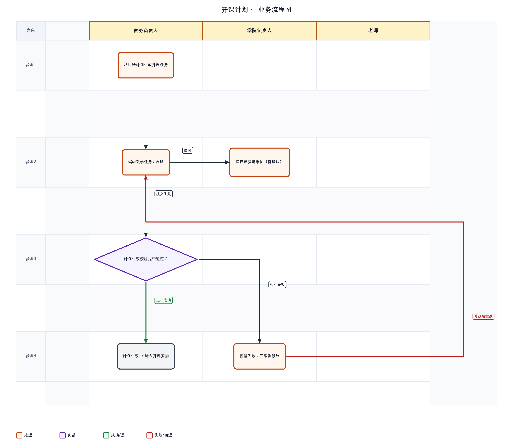
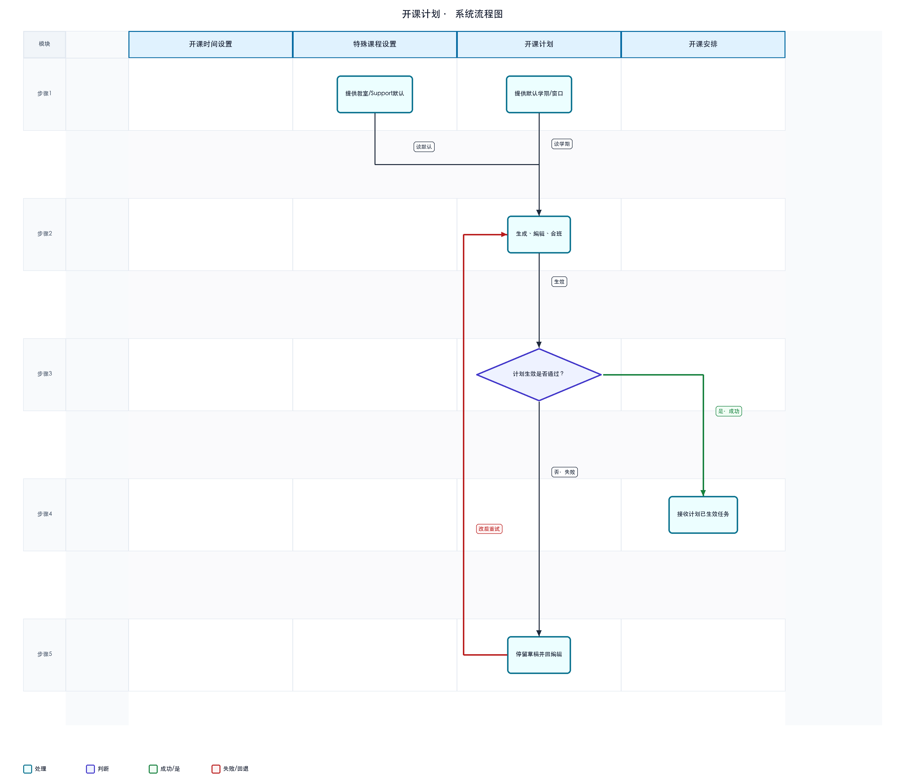

# 开课计划 · 详细设计

> 依据：可交互原型（`page-course-offering-major`）、需求文档《开课计划20260804V4》、概要设计《开课计划概要设计20260807V1》。

---

## 1. 文档信息

| 项 | 内容 |
|----|------|
| 文档名称 | 开课计划详细设计 |
| 菜单路径 | 开课管理 → 专业开课 → 开课计划 |
| 版本 | V1 |
| 日期 | 2026-08-07 |
| 填写人 | |
| 确认人 | |
| 确认状态 | 草稿 |
| 对应概要设计 | `../开课计划概要设计20260807V1/开课计划概要设计20260807V1.md` |
| 依据 | 原型 `index.html` / `app.js`；PRD `开课计划20260804V4`；跨模块依据笔记 |

## 2. 设计约定

| 约定项 | 说明 |
|--------|------|
| 术语 | **计划行**：1 门课 × 1 专业 × 1 入学批次；**教学班**：计划层对应一条可合班的教学任务；**生效**指计划层提交，非任务安排生效 |
| 状态口径 | **草稿 / 已生效 / 回退**（原型 `submitStatus`: draft / submitted / reverted） |
| 权限口径 | 教务可生成、编辑、合班（未生效）、生效、删除、查看预置人数与操作记录；学院权限待确认 |
| 数据来源口径 | 候选来自已锁定执行计划；默认展示学期来自开课时间设置；Support历史来自特殊课程设置 |

## 2.1 业务流程图（按角色泳道）

> 泳道按**角色**划分：教务负责人、学院负责人、老师。不参与步骤的泳道留空。圆角矩形为处理，菱形为判断，灰框为说明或结束。
> **绿色箭头/标签**表示通过或成功分支；**红色箭头/标签**表示失败、否决或回退，并标明回到哪一步。



## 2.2 系统流程图（按模块 / 菜单 / 功能泳道）

> 泳道按**系统模块、菜单或功能**划分，描述模块间数据与控制流转。
> 同样用绿/红标注成功与失败回退路径（例如开课安排生效失败 → 回到分组/教师确认补齐）。



## 3. 页面结构

### 3.1 主页面

- **区域划分**：页头 → 筛选区 → 工具栏（生成开课任务、生效、删除、一键合班）→ 列表 → 分页
- **默认进入条件**：默认学期筛选依赖开课时间设置「默认展示学期」；列表展示当前筛选下计划行

### 3.2 弹窗 / 抽屉 / 子页

| 名称 | 触发方式 | 用途 |
|------|----------|------|
| 生成开课任务 | 工具栏 | 从执行计划候选勾选生成计划行 |
| 修改教学任务 | 列表「课程信息」 | 维护选课类型、起止周、人数、开关、教室等 |
| 合拆班 | 操作列「合班」 | 合并/拆分专业批次（仅未生效） |
| 设置起止周 | 抽屉内嵌弹窗 | 周次点选网格 |
| 学生预置人数 | 列表「预置人数」 | 只读查看可修预置名单规模 |
| 操作记录 | 列表链接 | 字段变更历史 |
| 回退说明 | 状态=回退时 | 查看退回原因 |

## 4. 查询与列表

### 4.1 筛选项

| 筛选项 | 控件类型 | 说明 |
|--------|----------|------|
| 学年学期 | 下拉 | — |
| 专业 | 下拉 | 全部专业 |
| 开课单位 | 下拉 | — |
| 课程号 | 文本 | — |
| 生效状态 | 下拉 | 全部 / 草稿 / 已生效 / 回退 |
| 查询 / 重置 | 按钮 | — |

### 4.2 列表列

| 列名 | 说明 | 备注 |
|------|------|------|
| 勾选 | 生效 / 删除 | — |
| 开课学期 / 负责人 | — | 生成时记入负责人 |
| 生效状态 | 草稿/已生效/回退 | — |
| 课程代码 / 名称 / 类别 | — | — |
| 选课类型 | 不开放 / 开放选课 | — |
| 上课专业 / 批次 / 是否新生 | 合班可多值 | 影响计划人数口径 |
| 学分 / 总学时 / 起止周 | — | — |
| 开课单位 | — | — |
| 预置人数 | 链接 | 打开预置抽屉 |
| 操作记录 / 课程信息 | 链接 | — |
| 合班 | 按钮 | 已生效禁用 |
| 回退说明 | 条件链接 | 回退态可见 |

### 4.3 排序 / 分页 / 批量选择

- 工具栏批量：生效、删除（需勾选）
- 一键合班：当前学期下未生效且规则一致的可合班班

## 5. 关键动作

| 动作 | 入口 | 前置条件 | 结果 | 备注 |
|------|------|----------|------|------|
| 生成开课任务 | 工具栏弹窗 | 存在默认展示学期；执行计划已锁定 | 新建计划行（默认不合班） | 已存在「课+专业+批次」跳过 |
| 生成并自动合班 | 弹窗一键生成 | 同上 | 新班与未生效草稿互合 | 不与已生效班合并 |
| 一键合班 | 工具栏 | 存在可合未生效班 | 按规则批量合班 | 合班后清分组/教师 |
| 修改教学任务 | 课程信息 | 任务未生效时可改更多字段 | 保存抽屉 | 已生效后 mainly 教室；任务生效后整抽屉只读 |
| 合班 | 操作列 | 计划未生效 | 专业批次合并 | 已生效改去开课安排 |
| 生效 | 工具栏 | 勾选草稿/回退 | 计划→已生效 | 进入开课安排可见 |
| 删除 | 工具栏 | 非已生效 | 删除计划及关联班/名单 | 已生效须先被安排页退回 |
| 查看预置人数 | 列链接 | — | 只读抽屉 | 老生口径来源 |

## 6. 校验与业务规则

| 编号 | 规则 | 触发时机 | 不满足时表现 |
|------|------|----------|--------------|
| R1 | 生成须存在默认展示学期 | 打开生成弹窗 | 拦截或提示 |
| R2 | 同学期同课+专业+批次唯一 | 生成 | 跳过重复 |
| R3 | 仅非已生效可删 | 删除 | 硬拦截 |
| R4 | 计划总人数三口径 | 保存抽屉 | 不开放·老生=预置只读；不开放·新生=招生计划只读；开放选课可编≥0 |
| R5 | 学时全 0 → 排场地/考勤默认否；否则默认是 | 字段无值时 | 可手工改；合班双方须一致 |
| R6 | 保存须：起止周非空且在教学周内；预留≥0；开放选课人数≥0 | 保存抽屉 | 阻止保存 |
| R7 | 合班前提：同学期同课号；学分/总学时/起止周/开关一致 | 合班确定 | 拦截 |
| R8 | 合班副作用：人数预留累加；清分组/教师/教室偏好；任务安排重置草稿 | 合班成功 | — |
| R9 | Support历史只读，取自特殊课程设置 | 抽屉展示 | 本页不可改 |

## 7. 状态流转

```text
草稿 ──生效──► 已生效 ──开课安排「退回」──► 回退 ──再生效──► 已生效
  │                    （保留合班；清分组/教师）
  └──删除──► 移除（可再生成）
```

| 状态 | 含义 | 可执行动作 |
|------|------|------------|
| 草稿 | 计划未生效 | 编辑、合班、生效、删除 |
| 已生效 | 计划已提交 | 开课安排可见；本页合班禁用 |
| 回退 | 自安排页退回 | 可改后再生效；合班结构保留须手动拆 |

## 8. 数据对象（原型已知）

| 对象 / 字段 | 含义 | 来源 / 备注 |
|-------------|------|-------------|
| 计划行 / 教学班 id | 列表行标识 | 已知 · 原型演示 |
| submitStatus | 计划生效状态 | 已知 · draft/submitted/reverted |
| 计划总人数 / 预留 / 名额上限 | 人数三字段 | 已知 · 上限=计划+预留 |
| 起止周 | 教学周范围 | 已知 · 用户保存后不被静默覆盖 |
| 选课类型 | 开放/不开放 | 已知 · 默认不开放 |
| Support历史 | Y/N | 已知 · 特殊课程设置 |
| 合班专业批次列表 | 合班后多专业 | 已知 · 合拆班抽屉 |
| 预置人数 | 老生可修规模 | 已知 · 只读查看 |

## 9. 上下游与跨模块约束

| 方向 | 模块 | 关系说明 |
|------|------|----------|
| 上游 | 开课时间设置 | 默认展示学期 |
| 上游 | 培养方案执行计划 | 已锁定计划提供生成候选 |
| 上游 | 特殊课程设置 | Support历史、教室默认（安排侧带出） |
| 下游 | 开课安排 | **仅计划已生效**的教学班进入安排列表 |
| 下游 | 开课名单 | 须计划已生效 **且** 任务安排已生效 |
| 并行 / 约束 | 主链路 | 开课时间设置 → **本页** → 开课安排 → 开课名单 |

## 10. 异常与提示

| 场景 | 提示或处理 |
|------|------------|
| 删除已生效计划 | 提示须先经开课安排退回 |
| 一键合班无可合班 | 提示无未生效满足规则的课程班 |
| 合班后需重做安排 | 合班确认文案说明清分组/教师 |
| 生效未勾选 | 提示请先选择 |

## 11. 待确认清单

| 编号 | 事项 | 阻塞程度 |
|------|------|----------|
| 1 | 学院与教务合班权限矩阵 | 中 |
| 2 | 合班混合批次人数分摊的报表口径 | 低 |
| 3 | 学院筛选项是否恢复显示 | 低 |
